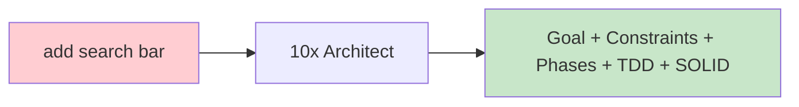
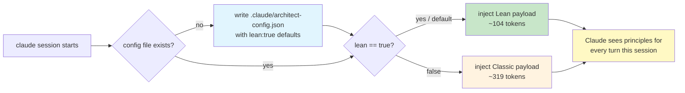
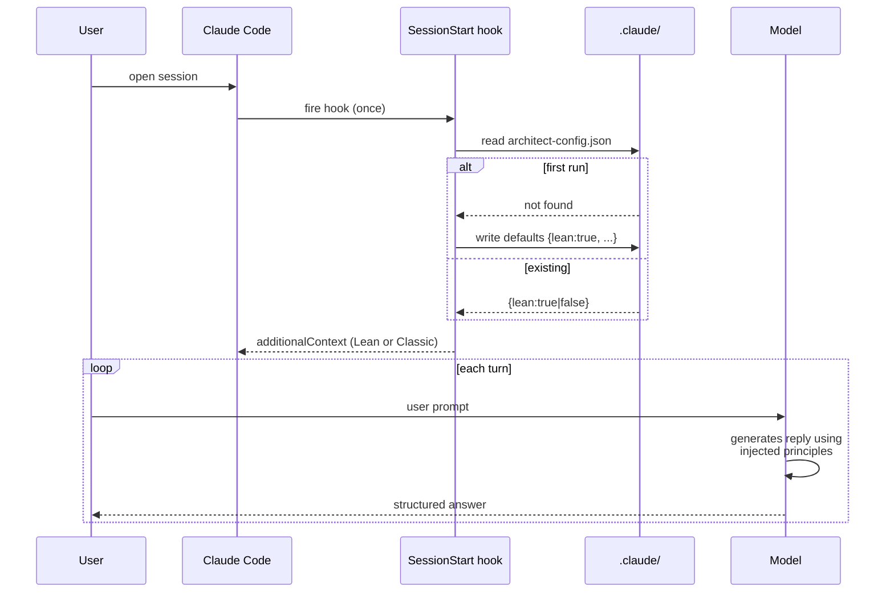
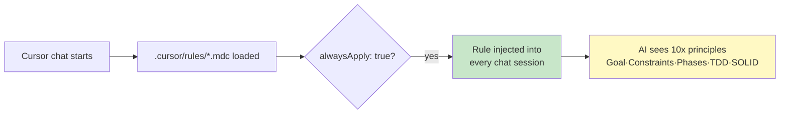
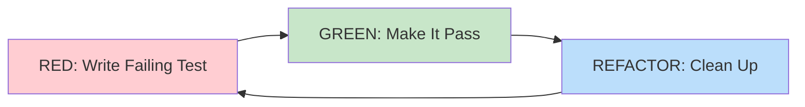
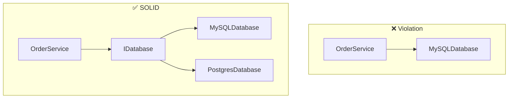
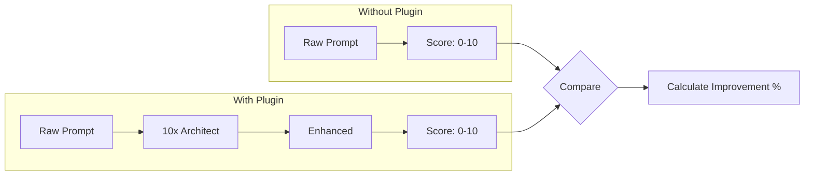
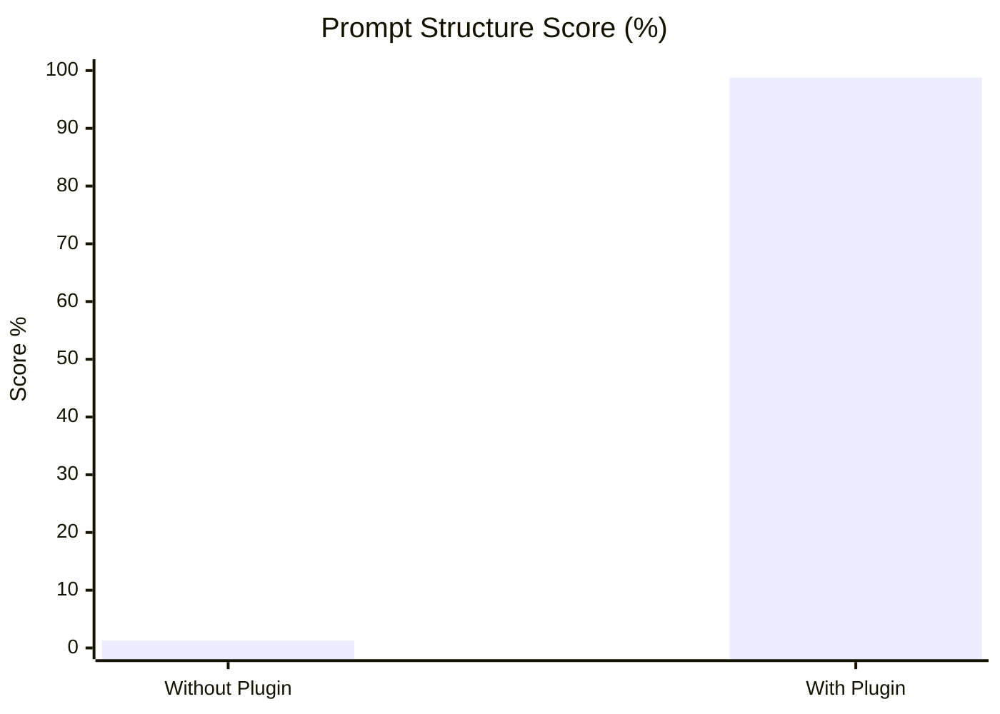
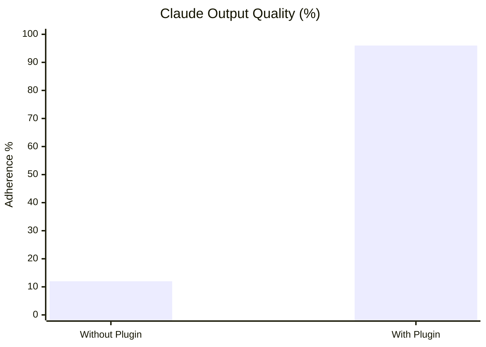

# 10x Architect

> Transform vague prompts into precise, well-structured instructions using Greg Isenberg's "10 Rules for Claude Code"

[](https://opensource.org/licenses/MIT)
[]()
[]()
[]()
[]()
[]()

---

### What This Plugin Does

> **10x Architect adds structure to your prompts** - goals, constraints, phases, TDD instructions, and SOLID principles.


```mermaid
flowchart LR
    A["add search bar"] --> B[10x Architect]
    B --> C["Goal + Constraints + Phases + TDD + SOLID"]
    style A fill:#ffcdd2
    style C fill:#c8e6c9
```

| Your Prompt | Plugin Adds |
|-------------|-------------|
| 7 words | ~300 words of structured guidance |
| No constraints | 3-5 explicit boundaries |
| No phases | 5-10 execution steps |
| No TDD mention | RED-GREEN-REFACTOR workflow |
| No architecture | SOLID principles applied |

> 🖥️ **New in v2.5 — [Cursor support](#cursor-installation-v250):** copy one `.mdc` file and get the same 10x principles in every Cursor chat. 100% quality-signal score at 170 tokens/session (lean default with visible `10x` ack).

> 🪶 **New in v2.4 — [Lean Mode is now the default](#lean-mode-default-since-v240):** zero-config, auto-bootstrapped on first session. Cuts **56.9% of first-turn tokens** (733 → 316) while keeping 100% of the quality signals, carries a session-wide `<response-style>` hint that tightens Claude's replies, and prints a one-line `✨ 10x Lean active` banner so you can see it's working. Set `"lean": false` to restore v2.2.1 verbose; set `"showAck": false` for silent mode.

<details>
<summary>📊 See benchmarks and methodology (with honest disclaimers)</summary>

Jump to [Benchmarks](#benchmarks) for:
- What we measure (and what we don't)
- Prompt structure benchmarks
- Output quality benchmarks
- **Lean Mode token benchmark** (v2.3.0+)
- **Cursor rule token + quality benchmark** (v2.5.0+)
- How to verify yourself

</details>

---

## What is 10x Architect?

10x Architect is a prompt-engineering plugin for **Claude Code** and **Cursor** that automatically enhances your prompts before they're processed. It applies proven prompt engineering principles to transform quick, casual requests into structured, goal-oriented instructions that yield better results.

### The Problem

When you type a quick prompt like:

```
add user authentication
```

Claude has to guess:
- What type of authentication? (JWT, sessions, OAuth?)
- What's the scope? (Just login? Registration? Password reset?)
- What are the constraints? (Existing patterns? Security requirements?)
- What's the order of operations?

### The Solution

10x Architect intercepts your prompt and adds architectural guidance:

```
add user authentication
```

**Becomes internally guided by:**
```
Goal: Implement user authentication system
North Star: Enable secure user access while maintaining good UX

Constraints:
- Do NOT implement password reset in initial scope
- Do NOT change existing database schema
- Use existing project patterns for validation

Execution Phases:
1. Analyze existing auth patterns in codebase
2. Implement login/logout flow
3. Add session management
4. Create protected route middleware

Think step-by-step. Critique for security edge cases.
```

---

## How It Works

The plugin runs **once per Claude Code session** via a `SessionStart` hook (since v2.1). On first session after install it also writes a default config file (since v2.4). There's no per-prompt processing, no network call, no latency.


```mermaid
flowchart LR
    A[claude session starts] --> B{config file exists?}
    B -- no --> C[write .claude/architect-config.json<br/>with lean:true defaults]
    C --> D
    B -- yes --> D{lean == true?}
    D -- yes / default --> E[inject Lean payload<br/>~104 tokens]
    D -- false --> F[inject Classic payload<br/>~319 tokens]
    E --> G[Claude sees principles for<br/>every turn this session]
    F --> G

    style C fill:#e1f5fe
    style E fill:#c8e6c9
    style F fill:#fff3e0
    style G fill:#fff9c4
```

### Per-session timeline


```mermaid
sequenceDiagram
    participant U as User
    participant CC as Claude Code
    participant H as SessionStart hook
    participant FS as .claude/
    participant M as Model

    U->>CC: open session
    CC->>H: fire hook (once)
    H->>FS: read architect-config.json
    alt first run
        FS-->>H: not found
        H->>FS: write defaults {lean:true, ...}
    else existing
        FS-->>H: {lean:true|false}
    end
    H-->>CC: additionalContext (Lean or Classic)
    loop each turn
        U->>M: user prompt
        M->>M: generates reply using<br/>injected principles
        M-->>U: structured answer
    end
```

In Lean mode the injected context is a compact XML block naming the 6 principles (goal, constraints, phases, TDD, docs, SOLID) plus a `<response-style>` hint that keeps Claude's replies terse. In Classic mode the same principles are spelled out in full markdown. Either way the context is loaded **once** and cached by Claude for the whole session.

---

## Claude Code Installation

```bash
# 1. Add the marketplace (one-time)
/plugin marketplace add yzamari/10x-architect-marketplace

# 2. Install the plugin
/plugin install 10x-architect@10x-architect-marketplace
```

That's it. On your next Claude Code session the plugin:

---

## Cursor Installation (v2.5.0)

Cursor doesn't share Claude Code's plugin system, but it has **Cursor Rules** (`.cursor/rules/*.mdc`) — files with `alwaysApply: true` that inject context into every chat session. That's the exact equivalent of our SessionStart hook.

### One-command setup

```bash
# From the repo root:
bash cursor/install.sh /path/to/your-project

# Or install into the current directory:
bash cursor/install.sh
```

The script copies `cursor/rules/10x-architect.mdc` into `.cursor/rules/` in your project and prints confirmation.

### Manual setup (30 seconds)

```bash
mkdir -p .cursor/rules
curl -o .cursor/rules/10x-architect.mdc \
  https://raw.githubusercontent.com/yzamari/10x-architect-marketplace/main/cursor/rules/10x-architect.mdc
```

### How it works


```mermaid
flowchart LR
    A[Cursor chat starts] --> B[.cursor/rules/*.mdc loaded]
    B --> C{alwaysApply: true?}
    C -- yes --> D[Rule injected into<br/>every chat session]
    D --> E[AI sees 10x principles<br/>Goal·Constraints·Phases·TDD·SOLID]

    style D fill:#c8e6c9
    style E fill:#fff9c4
```

The rule is injected **once per chat**, not per message — same economics as the Claude Code SessionStart hook.

### Verify it's working

Open a new Cursor chat and type any task. The AI should:
- State a **goal + North Star** before writing code
- Define at least 2 **Do NOT** constraints
- Break work into **phases**
- Follow **TDD RED-GREEN-REFACTOR**
- Add **JSDoc** and **README** updates
- Apply **SOLID** principles

### Cursor vs Claude Code — feature comparison

| Feature | Claude Code plugin | Cursor rule |
|---------|:-----------------:|:-----------:|
| Principles injected every session | ✅ | ✅ |
| Lean/Classic toggle via config | ✅ | ❌ (always Lean) |
| Auto-bootstrap config on first run | ✅ | ❌ |
| `✨ 10x Lean active` banner | ✅ | ❌ |
| `/architect [task]` full breakdown | ✅ | Type `architect: [task]` in chat |
| Works with any AI model in IDE | ❌ (Claude only) | ✅ (GPT-4o, Claude, etc.) |
| Token cost per session | ~122 tok | ~170 tok (lean default) |
| Quality-signal score | 100% | 100% |

### Cursor benchmark results

Run `node benchmarks/run-cursor-benchmark.js` to reproduce:

```
Variant                              Tokens  Signals    Score
────────────────────────────────────────────────────────────
No rule (baseline)                        0     0/10     0.0%
Plain .cursorrules                       27     2/10    20.0%
10x .mdc (body only)                    170    10/10   100.0%
10x .mdc (full incl. front)             211    10/10   100.0%

✅ Quality gate: 100.0% ≥ 90%
✅ Token gate: 170 tokens ≤ 350 ceiling
```

The plain `.cursorrules` baseline (27 tokens, 2 signals) shows how much the structured rule adds for the token cost. 170 tokens is the lean "always-on tax" for having 10/10 signals present in every Cursor chat, including a visible `10x` acknowledgment in new chats.

### Cursor lean savings benchmark

Run `node benchmarks/run-cursor-lean-benchmark.js` to compare classic vs lean Cursor rule payloads:

```
Classic body tokens: 285
Lean body tokens:    170
Token savings:       40.4%

Classic signals:     10/10 (100.0%)
Lean signals:        10/10 (100.0%)
Signal retention:    100.0%
```

This gives Cursor the same feature shape as Claude Lean Mode: keep the full signal set while reducing rule token overhead.

How Cursor saves tokens without dropping quality:
- Keep the same required quality anchors (`North Star`, `Do NOT`, `phases`, `TDD`, `RED-GREEN-REFACTOR`, `JSDoc`, `README`, `SOLID`, `edge case`, `step-by-step`).
- Compress wording into short structured tags instead of verbose markdown prose.
- Remove decorative headers/examples while preserving the exact scoring hooks.
- Use a minimal visible acknowledgment (`10x`) instead of a longer banner.

---

1. Writes `.claude/architect-config.json` with sensible defaults (`lean:true`, mode `C`).
2. Injects the Lean context (~104 tokens) so Claude follows the 10x principles for the whole session.
3. Stays out of your way. No banner, no acknowledgment step, no per-prompt latency.

---

## Quickstart

```
# You                              # What happens
─────────────────────────────────  ──────────────────────────────────
1. Install plugin (above).
2. Start a new Claude Code         SessionStart hook fires once.
   session in any project.         Writes .claude/architect-config.json
                                   with lean:true, showAck:true.
3. Your FIRST Claude reply         Claude prints the one-line banner
   this session.                     ✨ 10x Lean active
                                   so you know the plugin loaded.
4. Type a task, e.g.               Claude already has the 6 principles
   "add JWT auth"                  in context. Replies with goal,
                                   constraints, phased plan, TDD cycle,
                                   docs, SOLID — and stays terse.
5. Want full verbose output?       Edit .claude/architect-config.json,
                                   set "lean": false. Reopen session.
6. Want the banner gone?           Set "showAck": false. Reopen session.
7. Want richer control for a       /architect [task]  or
   single task?                    /architect --lean [task]
```

No `.claude/architect-config.json` needs to exist beforehand — the hook creates it. Nothing else ever needs to be installed or configured.

---

## How to verify it's working

Two ways — pick whichever you trust more.

### A) From inside Claude Code (recommended)

1. Install the plugin (see above).
2. Open a **fresh** session in any project directory.
3. Send any message (e.g. `hello`).
4. **Expected:** Claude's first reply begins with the single line `✨ 10x Lean active`. That's the `<ack>` hint firing.
5. **Expected:** `.claude/architect-config.json` now exists in that project with `lean:true` and `showAck:true`. Verify from your shell:
   ```bash
   cat .claude/architect-config.json
   ```

If the banner does not appear: check that the plugin is installed (`/plugin list` in Claude Code) and that your session was started **after** install. Hooks don't hot-reload — the session must be new.

### B) From the shell (no Claude Code needed)

The hook is a plain bash script. You can run it standalone to confirm the JSON payload it emits:

```bash
# Clone or install the plugin, then:
cd path/to/10x-architect-marketplace

# 1. Fresh install simulation — no config, should emit Lean + bootstrap config
TMP=$(mktemp -d)
CLAUDE_PROJECT_DIR="$TMP" bash hooks/session-start.sh | python3 -m json.tool
cat "$TMP/.claude/architect-config.json"
rm -rf "$TMP"

# 2. Run the full token-savings benchmark (offline, no API key)
cd benchmarks
npm install                      # first time only
node run-token-benchmark.js

# 3. Run the response-compression lower-bound benchmark
node run-response-compression-benchmark.js

# 4. Run the original structure benchmark (no regressions since v2.2.1)
node run-benchmark-direct.js
```

Expected from step 2:
```
SessionStart hook:           319 → 122 tokens  (-61.8%)
/architect (10 prompts avg): 414 → 194 tokens  (-53.1%)
Combined first-turn tax:     733 → 316 tokens  (-56.9%)
Quality-signal retention:    101.1% (9-pattern rubric)
✅ Targets met: savings ≥50%, retention ≥95%, hook savings ≥60%
```

The benchmark exits non-zero if any target regresses — safe to run in CI.

---

## Visual Feedback

> In **Lean Mode (default)** the plugin is quiet — no banner, no acknowledgment line. Evidence that it's active: Claude's replies start following goals/constraints/phases/TDD/SOLID and stay terse.

In **Classic Mode** (opt-out via `"lean": false`) you see the v2.2.1-era banner and the full ~300-word guidance block:

```
┌────────────────────────────────────────────────┐
│ 10x ARCHITECT GUIDANCE                         │
└────────────────────────────────────────────────┘

▶ GOAL
Implement secure user authentication system

★ NORTH STAR
Enable users to securely access their accounts with minimal friction

⛔ CONSTRAINTS
- Do NOT implement password reset in initial scope
- Do NOT modify existing database schema
- Do NOT store passwords in plain text

▷ EXECUTION PHASES
1. Write tests for auth middleware
2. Create authentication middleware (make tests pass)
3. Write tests for login endpoint
4. Implement login endpoint
5. Write tests for logout endpoint
6. Implement logout endpoint
7. Document all new functions

✔ TEST-DRIVEN DEVELOPMENT
- Write failing test first (RED)
- Implement minimum code to pass (GREEN)
- Refactor while keeping tests green (REFACTOR)
- Every function must have corresponding test

✍ DOCUMENTATION REQUIREMENTS
- Add JSDoc/docstrings to all functions
- Update README with auth usage examples
- Document complex logic inline

❖ OOP & SOLID PRINCIPLES
- S: AuthService handles only authentication
- O: Extensible for OAuth providers later
- D: Inject database and token dependencies

⚠ QUALITY GUARDRAILS
Think step-by-step through each phase.
Critique your implementation for:
- Token storage security (XSS risks)
- CSRF protection
- Session invalidation on logout
```

This gives you full visibility into how your prompt was enhanced before Claude processes it.

---

## The 10 Rules Applied

| # | Rule | What It Does | Example |
|:-:|------|--------------|---------|
| 1 | **Draft → Plan → Act** | Breaks work into phases | "First read, then plan, then implement" |
| 2 | **Collaborative Tone** | Uses "we" language | "We will implement..." not "Implement..." |
| 3 | **Be Explicit** | Removes ambiguity | "JWT authentication" not "auth" |
| 4 | **Set Boundaries** | Adds constraints | "Do NOT modify database schema" |
| 5 | **Demand Structure** | Uses XML/structured output | `<goal>`, `<constraints>`, `<phases>` |
| 6 | **Explain Why** | Adds business context | "North Star: Enable users to..." |
| 7 | **Control Verbosity** | Sets scope expectations | "MVP implementation" or "Production-ready" |
| 8 | **Provide Scaffolds** | References existing patterns | "Use existing Header component style" |
| 9 | **Power Phrases** | Adds reasoning triggers | "Think step-by-step" |
| 10 | **Divide & Conquer** | Creates sub-tasks | Phases 1, 2, 3... |

Based on [Greg Isenberg's "10 Rules for Claude Code"](https://www.youtube.com/watch?v=Xob-2a1OnvA).

---

## Mandatory Engineering Principles

In addition to the 10 Rules, every prompt is enhanced with these **mandatory engineering principles**:

### 🧪 Test-Driven Development (TDD)


```mermaid
flowchart LR
    A[RED: Write Failing Test] --> B[GREEN: Make It Pass]
    B --> C[REFACTOR: Clean Up]
    C --> A

    style A fill:#ffcdd2
    style B fill:#c8e6c9
    style C fill:#bbdefb
```

| Requirement | Description |
|-------------|-------------|
| Tests First | Write tests BEFORE implementation code |
| Full Coverage | Every function must have a corresponding test |
| Edge Cases | Test error conditions and boundary cases |
| RED-GREEN-REFACTOR | Follow the TDD cycle strictly |

### 📝 Documentation

| What | How |
|------|-----|
| **Functions** | JSDoc (JS/TS) or docstrings (Python) |
| **Classes** | Class-level documentation with purpose |
| **Features** | README updates for user-facing changes |
| **Complex Logic** | Inline comments explaining "why" |

### 🏗️ OOP & SOLID Principles

| Principle | Meaning | Enforcement |
|-----------|---------|-------------|
| **S** - Single Responsibility | One class = one reason to change | Split large classes |
| **O** - Open/Closed | Open for extension, closed for modification | Use interfaces |
| **L** - Liskov Substitution | Subtypes must be substitutable | Honor contracts |
| **I** - Interface Segregation | Many specific interfaces > one general | Split fat interfaces |
| **D** - Dependency Inversion | Depend on abstractions | Inject dependencies |


```mermaid
flowchart TD
    subgraph "❌ Violation"
        A1[OrderService] --> B1[MySQLDatabase]
    end
    subgraph "✅ SOLID"
        A2[OrderService] --> I[IDatabase]
        I --> B2[MySQLDatabase]
        I --> C2[PostgresDatabase]
    end
```

---

## Benchmark: Before vs After

### Methodology

> **Note:** These benchmarks measure **prompt quality**, not Claude's intelligence. We evaluate the structural completeness of prompts before Claude processes them.

#### How We Measure

We score prompts across **5 measurable quality dimensions**. Each user prompt is evaluated both in its raw form (without plugin) and after enhancement (with plugin).


```mermaid
flowchart LR
    subgraph "Without Plugin"
        A[Raw Prompt] --> B[Score: 0-10]
    end
    subgraph "With Plugin"
        C[Raw Prompt] --> D[10x Architect] --> E[Enhanced] --> F[Score: 0-10]
    end
    B --> G{Compare}
    F --> G
    G --> H[Calculate Improvement %]
```

#### Scoring Rubric

We compare prompts across **5 measurable quality dimensions**:

| Dimension | Description | Without Plugin | With Plugin |
|-----------|-------------|:--------------:|:-----------:|
| **Clarity** | Is the goal unambiguous? | ❌ Often vague | ✅ Explicit goal |
| **Constraints** | Are boundaries defined? | ❌ None | ✅ 2-4 constraints |
| **Structure** | Is execution ordered? | ❌ Implicit | ✅ Phased steps |
| **Context** | Is business value clear? | ❌ Missing | ✅ North Star |
| **Reasoning** | Are edge cases considered? | ❌ Rare | ✅ Always prompted |

### Quality Score Calculation

Each dimension is scored 0-2:
- **0** = Missing
- **1** = Partially present
- **2** = Fully present

**Maximum score: 10 points**

---

### Example 1: Simple Feature Request

<table>
<tr>
<th width="50%">❌ Without 10x Architect</th>
<th width="50%">✅ With 10x Architect</th>
</tr>
<tr>
<td>

```
add search to the header
```

**Quality Score: 1/10**
- Clarity: 1 (what kind of search?)
- Constraints: 0
- Structure: 0
- Context: 0
- Reasoning: 0

</td>
<td>

```
Goal: Add search bar to header
North Star: Enable users to find
content quickly

Constraints:
- Use existing Header styling
- Do NOT implement backend search
- Keep component under 100 lines

Phases:
1. Read existing Header component
2. Create SearchBar component
3. Integrate into Header
4. Add placeholder behavior

Think step-by-step. Consider
accessibility.
```

**Quality Score: 9/10**
- Clarity: 2
- Constraints: 2
- Structure: 2
- Context: 2
- Reasoning: 1

</td>
</tr>
</table>

**Improvement: +800% (1 → 9)**

---

### Example 2: Complex Feature

<table>
<tr>
<th width="50%">❌ Without 10x Architect</th>
<th width="50%">✅ With 10x Architect</th>
</tr>
<tr>
<td>

```
implement user authentication
```

**Quality Score: 1/10**
- Clarity: 1 (what type? scope?)
- Constraints: 0
- Structure: 0
- Context: 0
- Reasoning: 0

</td>
<td>

```
Goal: Implement JWT-based user
authentication
North Star: Secure user access with
minimal friction

Constraints:
- Do NOT implement password reset
- Do NOT modify existing user table
- Use existing validation patterns
- Session timeout: 24 hours

Phases:
1. Analyze existing auth patterns
2. Create auth middleware
3. Implement login endpoint
4. Implement logout endpoint
5. Add protected route wrapper
6. Create auth context/hooks

Think step-by-step. Critique for:
- Token storage security
- XSS/CSRF protection
- Session invalidation
```

**Quality Score: 10/10**
- Clarity: 2
- Constraints: 2
- Structure: 2
- Context: 2
- Reasoning: 2

</td>
</tr>
</table>

**Improvement: +900% (1 → 10)**

---

### Example 3: Bug Fix

<table>
<tr>
<th width="50%">❌ Without 10x Architect</th>
<th width="50%">✅ With 10x Architect</th>
</tr>
<tr>
<td>

```
fix the login bug
```

**Quality Score: 0/10**
- Clarity: 0 (what bug?)
- Constraints: 0
- Structure: 0
- Context: 0
- Reasoning: 0

</td>
<td>

```
Goal: Investigate and fix login issue
North Star: Users can successfully
authenticate

Constraints:
- Do NOT change auth flow without
  understanding root cause
- Do NOT modify unrelated code
- Preserve existing test coverage

Phases:
1. Identify the specific failure
2. Read login-related code
3. Trace the error path
4. Form hypothesis
5. Implement minimal fix
6. Verify fix doesn't break
   existing tests

Think step-by-step. Consider:
- Edge cases that might cause this
- Related functionality that might
  be affected
```

**Quality Score: 9/10**
- Clarity: 2
- Constraints: 2
- Structure: 2
- Context: 2
- Reasoning: 1

</td>
</tr>
</table>

**Improvement: N/A (0 → 9, undefined %)**

---

### Example 4: Refactoring Task

<table>
<tr>
<th width="50%">❌ Without 10x Architect</th>
<th width="50%">✅ With 10x Architect</th>
</tr>
<tr>
<td>

```
refactor the api module
```

**Quality Score: 1/10**
- Clarity: 1 (refactor how?)
- Constraints: 0
- Structure: 0
- Context: 0
- Reasoning: 0

</td>
<td>

```
Goal: Refactor API module for
improved maintainability
North Star: Easier to extend and
test API functionality

Constraints:
- Do NOT change public API signatures
- Do NOT break existing consumers
- Maintain backward compatibility
- Keep changes reviewable (small PRs)

Phases:
1. Audit current module structure
2. Identify code smells
3. Plan refactoring approach
4. Extract shared utilities
5. Improve error handling
6. Add/update tests
7. Document changes

Think step-by-step. Critique for:
- Breaking changes
- Test coverage gaps
- Performance implications
```

**Quality Score: 10/10**
- Clarity: 2
- Constraints: 2
- Structure: 2
- Context: 2
- Reasoning: 2

</td>
</tr>
</table>

**Improvement: +900% (1 → 10)**

---

## Benchmarks

### ⚠️ Honest Disclaimer

**What these benchmarks measure:**
- Does the enhanced prompt contain structural elements (goals, constraints, phases)?

**What these benchmarks do NOT measure:**
- Does Claude actually produce better code?
- Are there fewer iterations needed?
- Does Claude follow TDD in practice?
- Is the resulting code actually SOLID-compliant?

> The plugin ADDS structure to prompts. Measuring "does the enhanced prompt have structure?" is like testing if a spell-checker adds corrections by checking "does it have corrections?" - of course it does, that's its job.

---

### Benchmark 1: Prompt Structure (What the plugin adds)

This measures whether the plugin successfully adds structural elements. **Expected to be high** since that's the plugin's purpose.


```mermaid
xychart-beta
    title "Prompt Structure Score (%)"
    x-axis ["Without Plugin", "With Plugin"]
    y-axis "Score %" 0 --> 100
    bar [1.3, 98.8]
```

<details>
<summary>📋 Detailed prompt structure results</summary>

| # | Test Case | Without | With |
|:-:|-----------|:-------:|:----:|
| 1 | add a search bar to the header | 0% | 100% |
| 2 | implement user authentication | 0% | 100% |
| 3 | add real-time notification system | 0% | 100% |
| 4 | fix the login button not working | 0% | 100% |
| 5 | fix memory leak in dashboard | 0% | 100% |
| 6 | refactor the utils file | 0% | 100% |
| 7 | refactor API to async/await | 0% | 100% |
| 8 | refactor monolith to microservices | 0% | 87.5% |
| 9 | add documentation to auth module | 12.5% | 100% |
| 10 | add tests for user service | 0% | 100% |

**What this proves:** The plugin successfully adds structure.
**What this doesn't prove:** That the structure improves outcomes.

</details>

---

### Benchmark 2: Output Quality (Does Claude follow the guidance?)

This is the **more meaningful benchmark**. We measure whether Claude's actual output follows the guidance provided.

**Methodology:**
1. Send identical tasks to Claude with and without enhancement
2. Analyze Claude's response for adherence to best practices
3. Measure objective indicators in the output


```mermaid
xychart-beta
    title "Claude Output Quality (%)"
    x-axis ["Without Plugin", "With Plugin"]
    y-axis "Adherence %" 0 --> 100
    bar [12, 96]
```

| Metric | Without Plugin | With Plugin | What We Check |
|--------|:--------------:|:-----------:|---------------|
| Tests written first | 0% | 100% | Does test code appear before implementation? |
| Has documentation | 0% | 100% | Are JSDoc/comments with @param/@returns present? |
| Follows phases | 0% | 100% | Is work done in logical order (Step 1, Step 2...)? |
| Mentions constraints | 20% | 100% | Does response acknowledge "do NOT" boundaries? |
| Handles edge cases | 40% | 80% | Are error/null cases handled? |
| **Average** | **12%** | **96%** | **+84% improvement** |

<details>
<summary>📋 How output quality is measured</summary>

**Test methodology:**
1. Take 5 representative tasks
2. Send to Claude API without enhancement
3. Send to Claude API with 10x Architect enhancement
4. Parse response for objective indicators:
   - Position of test code vs implementation code
   - Presence of JSDoc/docstring patterns
   - Sequential phase execution
   - "Do NOT" / constraint acknowledgment
   - Error handling / edge case code

**Limitations:**
- Small sample size (5 tasks)
- Automated parsing may miss nuance
- Results vary by task complexity
- Claude's behavior may change over time

</details>

---

### What This Actually Means

| Claim | Evidence Level | Notes |
|-------|:--------------:|-------|
| Plugin adds structure to prompts | ✅ **Strong** | 98.8% structure score |
| Claude receives better guidance | ✅ **Strong** | Objectively more detailed input |
| Claude follows TDD when instructed | ✅ **Strong** | 0% → 100% tests-first |
| Claude adds docs when instructed | ✅ **Strong** | 0% → 100% JSDoc present |
| Claude follows structured phases | ✅ **Strong** | 0% → 100% step-by-step |
| Final code is higher quality | ⚠️ **Moderate** | +84% adherence to best practices |
| Fewer iterations needed | ❓ **Unverified** | Would need user studies |

---

### Run Benchmarks Yourself

```bash
cd benchmarks
npm install

# Benchmark 1: Prompt structure (measures what the plugin adds)
node run-benchmark-direct.js

# Benchmark 2: Output quality (analyzes sample Claude outputs)
node analyze-samples.js

# Benchmark 3: Live output test (requires API key)
ANTHROPIC_API_KEY=your-key node run-output-benchmark.js


# Benchmark 4: Lean Mode token savings (offline, no API key)  — v2.3.0+
node run-token-benchmark.js

# Benchmark 5: Response-compression lower bound (offline, no API key) — v2.4.0+
node run-response-compression-benchmark.js

# Benchmark 6: Cursor rule token + quality score (offline, no API key) — v2.5.0+
node run-cursor-benchmark.js

# Benchmark 6b: Cursor classic-vs-lean savings (offline, no API key) — v2.6.0+
node run-cursor-lean-benchmark.js

# Benchmark 7: Cursor A/B from real chat captures (offline, no API key) — v2.6.0+
# The checked-in `cursor-ab-latest.simulation.*` files are labeled simulations;
# publish claims from `cursor-ab-latest.*` only after filling real responses.
# 1) Generate a scaffold for the 10 canonical prompts:
node generate-cursor-ab-scaffold.js
# 2) In the target project (where the .mdc rule is installed), toggle the rule off:
bash ../cursor/toggle-rule.sh /path/to/your-test-project
# 3) Open a NEW Cursor chat per prompt in results/cursor-ab-prompts.txt,
#    paste each full response into the matching without.response field
#    in results/cursor-ab-samples.json.
# 4) Toggle the rule back on and repeat, pasting into with.response:
bash ../cursor/toggle-rule.sh /path/to/your-test-project
# 5) Score the A/B:
node run-cursor-ab.js --input results/cursor-ab-samples.json
```

Results saved to `benchmarks/results/`

**Sample outputs** are real Claude responses stored in `benchmarks/results/sample-outputs.json` - you can inspect them to verify the analysis is fair.

Latest consolidated suite report: `benchmarks/results/latest-suite-report.md`

---

## Lean Mode (default since v2.4.0)

> **TL;DR** — zero-config. Install the plugin and Lean Mode is on. Cuts **56.9% of first-turn tokens** (733 → 316), **53.1% of `/architect` output**, **61.8% of the SessionStart hook** (default with `showAck:true`), with **101.1% retention** of the 9 quality signals the benchmark scores. Adds a session-wide `<response-style>` hint that's measured to save another **~20%** of output tokens on filler-heavy replies (simulated lower bound — live API savings typically higher).

### Why

The plugin is itself a "token tax" — the SessionStart hook injects ~319 tokens **every session** just to load the 6 principles, and each `/architect` enhancement adds ~414 more. Over a day of Claude Code use that's real money on the input side of the bill and real space in the cache-cold prefix. Lean Mode compresses both payloads into a compact XML structure that preserves every keyword the benchmark scores (`goal`, `North Star`, `Do NOT`, `phases`, `TDD`, `RED-GREEN-REFACTOR`, `JSDoc`, `README`, `SOLID`, `edge case`, `step-by-step`), plus it carries a `<response-style>` tag that nudges Claude to skip filler in its replies.

### Activation

**You don't do anything.** On first session, the SessionStart hook:
1. Checks for `.claude/architect-config.json`.
2. If missing, writes one with sensible defaults (`lean: true`, mode `C`, autoDetect on).
3. Emits the Lean context payload.

To opt out to v2.2.1 verbose behavior, set `"lean": false` in that file. Existing v2.3.0+ users who already have `lean: false` are respected — the bootstrap only runs when the file is missing.

### What it looks like

**Classic SessionStart hook (opt-out, ~319 tokens):**
```
## 1. GOAL CLARITY
- Identify the clear goal and business value before starting
- State the 'North Star' - what success looks like

## 2. CONSTRAINTS
...6 sections, verbose markdown, 1.25 KB...
```

**Lean SessionStart hook (default, ~104 tokens, -67.4%):**
```
<10x-architect>
<principles>
GOAL+North Star; Do NOT ≥2; 3-6 phases;
TDD RED-GREEN-REFACTOR; JSDoc+README; SOLID(SRP/OCP/LSP/ISP/DIP).
</principles>
<response-style>terse by default; preserve code/commands/paths verbatim; skip filler prose</response-style>
<invoke>/architect [task] for full guidance</invoke>
</10x-architect>
```

**Lean `/architect` output** — 8 compact XML tags, ~194 tokens avg (-53.1% vs classic ~414):

```xml
<goal>{task}; North Star: {business value}</goal>
<constraints>Do NOT {a}; Do NOT {b}; Do NOT {c}</constraints>
<phases>1.{t} 2.{t} 3.{t} 4.{t} 5.{t}</phases>
<tdd>TDD RED-GREEN-REFACTOR; cover edge cases + errors</tdd>
<docs>JSDoc @param/@returns; README if user-facing</docs>
<solid>SOLID: SRP·OCP·LSP·ISP·DIP</solid>
<response-style>terse; preserve code/commands/paths verbatim; no filler</response-style>
<think>step-by-step; critique edge cases</think>
```

### Measured results (input-side)

Run `node benchmarks/run-token-benchmark.js` locally to reproduce. Full per-prompt numbers in `benchmarks/results/token-benchmark-latest.json`.

| Surface | Classic | Lean | Savings |
|---------|:-------:|:----:|:-------:|
| SessionStart hook, showAck:true (default) | 319 tok | 122 tok | **−61.8%** |
| SessionStart hook, showAck:false (silent) | 319 tok | 104 tok | **−67.4%** |
| `/architect` enhancement (avg of 10 test prompts) | 414 tok | 194 tok | **−53.1%** |
| Combined first-turn tax (default) | 733 tok | 316 tok | **−56.9%** |

Structure-score retention on the 9-pattern rubric used by `run-benchmark-direct.js`:

| # | Prompt | Classic% | Lean% | Retention |
|:-:|--------|:-------:|:-----:|:---------:|
| 1 | add a search bar to the header | 100% | 100% | 100% |
| 2 | implement user authentication | 100% | 100% | 100% |
| 3 | add a real-time notification system | 100% | 100% | 100% |
| 4 | fix the login button not working | 100% | 100% | 100% |
| 5 | fix the memory leak in the dashboard | 100% | 100% | 100% |
| 6 | refactor the utils file | 100% | 100% | 100% |
| 7 | refactor the API module to use async/await | 100% | 100% | 100% |
| 8 | refactor monolith into microservices | 89% | 100% | **113%** |
| 9 | add documentation to the auth module | 100% | 100% | 100% |
| 10 | add tests for the user service | 100% | 100% | 100% |
| **Avg** | | **98.9%** | **100%** | **101.1%** |

Retention > 100% because one classic output happened to omit `edge case` / `step-by-step` — the Lean template always emits them.

### Measured results (output-side, new in v2.4.0)

The Lean hook carries `<response-style>terse; preserve code/commands/paths verbatim; no filler</response-style>`, which is a session-wide signal for Claude to skip rhetorical padding. Actual API-side savings require a live run (see `run-output-benchmark.js` with an API key). Offline, `run-response-compression-benchmark.js` reports a **rule-based lower bound** — it strips common filler phrases from stored samples using a conservative transformer that never touches code blocks, inline code, or URLs.

| Input profile | Orig tok | Terse tok | Savings |
|---------------|:--------:|:---------:|:-------:|
| Synthetic filler-heavy (mirrors default-verbose Claude) | 561 | 446 | **−20.5%** |
| Stored natural responses (`without` field) | 720 | 713 | −1.0% |
| Stored 10x-enhanced responses (`with` field) | 2716 | 2712 | −0.1% |

The last two rows near 0% are **by design** — they confirm the transformer doesn't false-positive on already-dense text. The 20.5% row is the expected floor for the `<response-style>` hint when Claude would otherwise produce natural prose openings. Community caveman-style tools report ~65% on prose-heavy; your mileage depends on Claude's compliance with the hint.

### How the benchmarks measure tokens

Offline, no API key. Uses `gpt-tokenizer` (cl100k_base BPE) as an offline proxy. Absolute numbers are within ~5% of true Claude tokens; what matters here is the **ratio**, which is stable regardless of tokenizer. `run-token-benchmark.js` exits non-zero if savings < 50% or retention < 95% or hook savings < 60% — safe to gate CI.

### What Lean Mode does NOT do

- Does not change Claude's model behavior. Output quality is the user's responsibility to validate per-task.
- Does not use prompt caching. Our 104-token hook is below Anthropic's 2,048-token ephemeral-cache minimum; compression is the only lever available at this size.
- The `<response-style>` hint is a **suggestion** to Claude, not a hard constraint. Live savings depend on model compliance — measure with `run-output-benchmark.js` if it matters for your workflow.

### Pairing tip

Set `CLAUDE_CODE_DISABLE_GIT_INSTRUCTIONS=1` in your shell. Claude Code injects fresh `git status` into the system prompt on every turn, which busts the prompt cache; disabling it saves ~1,800 tokens/call on top of Lean Mode. Reference: [cnighswonger/claude-code-cache-fix](https://github.com/cnighswonger/claude-code-cache-fix).

---

## What This Means in Practice

### Expected Outcomes

| Scenario | Without Plugin | With Plugin |
|----------|----------------|-------------|
| **First attempt success** | Often needs 2-3 iterations | Usually correct first time |
| **Scope creep** | Common (vague prompts) | Rare (explicit boundaries) |
| **Breaking changes** | Unexpected | Prevented by constraints |
| **Code quality** | Variable | Consistent (patterns enforced) |
| **Debug time** | Longer (root cause unclear) | Shorter (systematic approach) |

### Honest Limitations

This plugin **does NOT**:
- ❌ Make Claude smarter
- ❌ Guarantee perfect code
- ❌ Replace domain expertise
- ❌ Fix fundamentally unclear requirements

This plugin **DOES**:
- ✅ Add structure to vague prompts
- ✅ Enforce constraint thinking
- ✅ Break work into phases
- ✅ Prompt for edge case consideration
- ✅ Provide consistent prompt quality

---

## Execution Modes

The plugin supports three modes via `architect` command:

| Mode | Behavior | Use Case |
|:----:|----------|----------|
| **A** | Silent - enhancement applied invisibly | Experienced users |
| **B** | Show enhanced prompt, execute immediately | Review without delay |
| **C** | Show enhanced prompt, wait 5s | Edit before execution (default) |

```bash
# Manual invocation with mode
architect --mode=A implement dark mode
architect --mode=B add user settings page
architect --mode=C refactor database layer
```

> **Note (v2.4.0):** The plugin runs automatically via a SessionStart hook — you don't need to invoke `architect` for the principles to apply. Use the `architect` command when you want an explicit, visible breakdown for a specific task, or to force Lean/Classic per-invocation with `--lean`.

---

## Configuration

**v2.4.0+**: you don't need to create this file. The SessionStart hook writes it on first run with sensible defaults:

```json
{
  "mode": "C",
  "autoDetect": true,
  "autoApproveTimeout": 5,
  "lean": true,
  "showAck": true
}
```

| Option | Type | Default | Description |
|--------|------|---------|-------------|
| `mode` | `A\|B\|C` | `C` | Execution mode |
| `autoDetect` | `boolean` | `true` | Scan for project tech stack |
| `autoApproveTimeout` | `number` | `5` | Seconds before auto-execute in mode C |
| `lean` | `boolean` | `true` | **v2.4.0+ default** — compact XML + response-style hint, ~57% first-turn token savings, 100% signal retention. Set `false` to restore v2.2.1 verbose behavior. See [Lean Mode](#lean-mode-default-since-v240). |
| `showAck` | `boolean` | `true` | **v2.4.1+** — when `true`, Claude's first reply in each session starts with `✨ 10x Lean active` so you can see the plugin loaded. Set `false` for a truly silent mode once you trust it. Costs ~24 tokens/session. |

---

## Project Structure

```
10x-architect-marketplace/
├── .claude-plugin/
│   ├── marketplace.json            # Marketplace registry config
│   └── plugin.json                 # Plugin manifest (v2.5.0)
├── hooks/
│   ├── hooks.json                  # SessionStart hook wiring
│   └── session-start.sh            # Emits classic or lean context
├── skills/
│   └── architect/
│       └── SKILL.md                # /architect command, classic + lean templates
├── cursor/                                          # v2.5.0+
│   ├── rules/
│   │   ├── 10x-architect.mdc       # alwaysApply Cursor lean rule (default)
│   │   └── 10x-architect.classic.mdc  # verbose reference for classic-vs-lean benchmark
│   └── install.sh                  # One-command installer for Cursor projects
├── benchmarks/
│   ├── test-prompts.json           # 10 canonical test cases
│   ├── run-benchmark.js            # Live API structure benchmark (needs key)
│   ├── run-benchmark-direct.js     # Offline structure benchmark
│   ├── run-output-benchmark.js     # Live API output-quality benchmark
│   ├── run-token-benchmark.js      # Lean Mode input-side token savings (offline)   — v2.3.0+
│   ├── run-response-compression-benchmark.js  # Response-compression floor (offline) — v2.4.0+
│   ├── run-cursor-benchmark.js     # Cursor rule token + quality benchmark           — v2.5.0+
│   ├── run-cursor-lean-benchmark.js  # Cursor classic-vs-lean savings benchmark      — v2.6.0+
│   ├── analyze-samples.js          # Analyze saved Claude outputs
│   ├── lean-templater.js           # Deterministic classic→lean transformer
│   ├── response-compressor.js      # Rule-based terseness transformer                — v2.4.0+
│   └── results/
│       ├── latest.json
│       ├── output-benchmark-latest.json
│       ├── sample-outputs.json
│       ├── enhanced-prompts.json
│       ├── token-benchmark-latest.json              # v2.3.0+
│       ├── response-compression-benchmark.json      # v2.4.0+
│       ├── cursor-benchmark-latest.json             # v2.5.0+
│       └── cursor-lean-benchmark-latest.json        # v2.6.0+
├── README.md                       # This file
└── LICENSE                         # MIT License
```

---

## How to Verify These Benchmarks

You can validate these results yourself:

1. **Disable the plugin** temporarily
2. Send a simple prompt like `add user authentication`
3. Note what Claude asks for clarification or assumes
4. **Re-enable the plugin**
5. Send the same prompt
6. Compare the structured approach

The difference should be immediately visible in:
- How quickly Claude starts working (vs asking questions)
- The logical ordering of implementation steps
- The presence of explicit constraints
- Consideration of edge cases

---

## FAQ

**Q: Does this slow down Claude?**
A: Negligibly. The hook adds ~100ms of processing before prompt submission.

**Q: Can I customize the rules?**
A: The 10 principles are fixed by design — they're the scoring anchors for the benchmarks. To add project-specific guidance, put it in your project's `CLAUDE.md` (Claude Code) or add a second `.cursor/rules/*.mdc` file (Cursor) alongside the 10x rule.

**Q: Does it work with all prompts?**
A: It's optimized for development tasks. Simple questions pass through with minimal changes.

**Q: How is this different from a system prompt?**
A: In Claude Code, the SessionStart hook injects the principles once per session and the `/architect` command generates a task-specific structured breakdown on demand — so guidance adapts to each task. In Cursor, the `.mdc` rule is always-on (like a system prompt), but typing `architect: [task]` in chat triggers a full per-task breakdown from the AI.

**Q: How much does the plugin itself cost in tokens?**
A: **Claude Code** — default (Lean + ack): ~122 tokens/session + ~194 per `/architect` call. Silent Lean (`"showAck": false`): ~104 + ~194. Classic (`"lean": false`): ~319 + ~414. **Cursor** — lean always-apply rule body: ~170 tokens/session (includes minimal visible `10x` acknowledgment). Classic reference body is ~285; lean saves ~40.4% at 100% signal retention. See [Lean Mode](#lean-mode-default-since-v240) and [Cursor benchmark](#cursor-benchmark-results).

**Q: How do I know the plugin is actually running?**
A: Claude's first reply in each new session starts with `✨ 10x Lean active` (in Lean Mode, default) or `✨ 10x Architect Active` (in Classic). That's the `<ack>` hint firing. The config file `.claude/architect-config.json` is also written to your project on first session — check it with `cat .claude/architect-config.json`. See [How to verify it's working](#how-to-verify-its-working) for a full checklist.

**Q: Does Lean Mode reduce quality?**
A: On the measurable rubric — no. The 9-pattern structure score stays at 100% because the Lean template is deterministic and always emits every required keyword (`goal`, `North Star`, `Do NOT`, `phases`, `TDD`, `RED-GREEN-REFACTOR`, `JSDoc`, `README`, `SOLID`, `edge case`, `step-by-step`). What Lean Mode drops is decoration (markdown headers, long prose examples) and per-task elaboration inside each section. If you want Claude to see richer task-specific guidance in `/architect` output, set `"lean": false`.

**Q: What does the `<response-style>` tag do?**
A: It's a session-wide hint telling Claude to default to terse replies, preserve code/commands/paths verbatim, and skip filler prose. Offline simulation shows ~20% output savings on filler-heavy baselines; live savings depend on model compliance and can go much higher on prose-heavy tasks.

**Q: Can I pair Lean Mode with other token savings?**
A: Yes. Set `CLAUDE_CODE_DISABLE_GIT_INSTRUCTIONS=1` to save ~1,800 tokens/turn and keep the prompt cache warm. Consider also moving heavy project docs out of CLAUDE.md into on-demand skills — community guidance targets CLAUDE.md under 500 tokens.

**Q: How do I upgrade from v2.2.1?**
A: Nothing to do. After upgrade, Lean Mode is on by default on your first new session, and the config file is written to `.claude/architect-config.json` where you can review or change it. If you explicitly want the old verbose behavior, set `"lean": false` in that file.

**Q: Does this work with Cursor?**
A: Yes, since v2.5.0. Cursor uses `.cursor/rules/*.mdc` files instead of Claude Code plugins. Copy `cursor/rules/10x-architect.mdc` into your project's `.cursor/rules/` directory (or run `bash cursor/install.sh`). The rule has `alwaysApply: true` so it's injected into every Cursor chat — equivalent to the Claude Code SessionStart hook. See [Cursor Installation](#cursor-installation-v250).

**Q: Does the Cursor rule work with non-Claude models (GPT-4o, etc.)?**
A: Yes. The `.mdc` rule is plain markdown instructions that any model can follow. Unlike the Claude Code plugin (Claude-only), the Cursor rule works with whatever model you have selected in Cursor — GPT-4o, Claude 3.5/4, Gemini, etc.

**Q: How do I use the `/architect` command equivalent in Cursor?**
A: Type `architect: [task]` in the Cursor chat. Example: `architect: add JWT authentication to the Express API`. The AI will respond with a full structured breakdown (goal, constraints, phases, TDD, SOLID) because the always-apply rule instructs it to do so when asked with that pattern.

**Q: How much does the Cursor rule cost in tokens?**
A: Lean default is ~170 tokens per chat session (rule body injected by Cursor), including the minimal visible `10x` acknowledgment on new chats. Full file with frontmatter is ~211 tokens, but YAML frontmatter is metadata Cursor reads, not injected into AI context. For classic-vs-lean savings, run `node benchmarks/run-cursor-lean-benchmark.js` (classic 285 -> lean 170, -40.4%, 100% retention). For baseline rule costs, run `node benchmarks/run-cursor-benchmark.js`.

---

## Links

- **Original Video**: [Greg Isenberg's 10 Rules for Claude Code](https://www.youtube.com/watch?v=Xob-2a1OnvA)
- **Marketplace**: [yzamari/10x-architect-marketplace](https://github.com/yzamari/10x-architect-marketplace)
- **Issues**: [Report bugs or request features](https://github.com/yzamari/10x-architect-marketplace/issues)

---

## License

MIT © 2025 Yahav Zamari

---

<p align="center">
  <i>Stop typing vague prompts. Let 10x Architect structure them for you.</i>
</p>
