# 10x Architect

> Transform vague prompts into precise, well-structured instructions using Greg Isenberg's "10 Rules for Claude Code"

[](https://opensource.org/licenses/MIT)
[]()
[]()

---

### Benchmark Results at a Glance

```mermaid
xychart-beta horizontal
    title "Prompt Quality: Before vs After"
    x-axis "Quality Score (0-10)" 0 --> 10
    y-axis ["With 10x Architect", "Without Plugin"]
    bar [9.5, 0.75]
```

| Metric | Result |
|--------|:------:|
| Quality Score Improvement | **+1167%** |
| Prompts with Clear Constraints | 0% → **100%** |
| Prompts with Execution Phases | 0% → **100%** |
| Prompts with Business Context | 0% → **100%** |

<details>
<summary>📊 See full benchmark methodology and results</summary>

Jump to [Benchmark: Before vs After](#benchmark-before-vs-after) for detailed test cases and scoring methodology.

</details>

---

## What is 10x Architect?

10x Architect is a Claude Code plugin that automatically enhances your prompts before they're processed. It applies proven prompt engineering principles to transform quick, casual requests into structured, goal-oriented instructions that yield better results.

### The Problem

When you type a quick prompt like:

```
add user authentication
```

Claude has to guess:
- What type of authentication? (JWT, sessions, OAuth?)
- What's the scope? (Just login? Registration? Password reset?)
- What are the constraints? (Existing patterns? Security requirements?)
- What's the order of operations?

### The Solution

10x Architect intercepts your prompt and adds architectural guidance:

```
add user authentication
```

**Becomes internally guided by:**
```
Goal: Implement user authentication system
North Star: Enable secure user access while maintaining good UX

Constraints:
- Do NOT implement password reset in initial scope
- Do NOT change existing database schema
- Use existing project patterns for validation

Execution Phases:
1. Analyze existing auth patterns in codebase
2. Implement login/logout flow
3. Add session management
4. Create protected route middleware

Think step-by-step. Critique for security edge cases.
```

---

## How It Works


### The Enhancement Pipeline


---

## Installation

```bash
# Step 1: Add the marketplace
/plugin marketplace add yzamari/10x-architect-marketplace

# Step 2: Install the plugin
/plugin install 10x-architect@10x-architect-marketplace
```

That's it! The plugin now automatically enhances all your prompts.

---

## Visual Feedback

When the plugin enhances your prompt, you'll see real-time feedback:

```
✨ 10x Architect Enhanced
├─ Goal: Add JWT-based user authentication
├─ Constraints: 3 boundaries set
├─ Phases: 5 execution steps
├─ TDD: Tests required first
├─ Docs: Documentation enforced
└─ SOLID: OOP principles applied
```

The full architectural guidance is then injected into the context:

```
┌────────────────────────────────────────────────┐
│ 10x ARCHITECT GUIDANCE                         │
└────────────────────────────────────────────────┘

▶ GOAL
Implement secure user authentication system

★ NORTH STAR
Enable users to securely access their accounts with minimal friction

⛔ CONSTRAINTS
- Do NOT implement password reset in initial scope
- Do NOT modify existing database schema
- Do NOT store passwords in plain text

▷ EXECUTION PHASES
1. Write tests for auth middleware
2. Create authentication middleware (make tests pass)
3. Write tests for login endpoint
4. Implement login endpoint
5. Write tests for logout endpoint
6. Implement logout endpoint
7. Document all new functions

✔ TEST-DRIVEN DEVELOPMENT
- Write failing test first (RED)
- Implement minimum code to pass (GREEN)
- Refactor while keeping tests green (REFACTOR)
- Every function must have corresponding test

✍ DOCUMENTATION REQUIREMENTS
- Add JSDoc/docstrings to all functions
- Update README with auth usage examples
- Document complex logic inline

❖ OOP & SOLID PRINCIPLES
- S: AuthService handles only authentication
- O: Extensible for OAuth providers later
- D: Inject database and token dependencies

⚠ QUALITY GUARDRAILS
Think step-by-step through each phase.
Critique your implementation for:
- Token storage security (XSS risks)
- CSRF protection
- Session invalidation on logout
```

This gives you full visibility into how your prompt was enhanced before Claude processes it.

---

## The 10 Rules Applied

| # | Rule | What It Does | Example |
|:-:|------|--------------|---------|
| 1 | **Draft → Plan → Act** | Breaks work into phases | "First read, then plan, then implement" |
| 2 | **Collaborative Tone** | Uses "we" language | "We will implement..." not "Implement..." |
| 3 | **Be Explicit** | Removes ambiguity | "JWT authentication" not "auth" |
| 4 | **Set Boundaries** | Adds constraints | "Do NOT modify database schema" |
| 5 | **Demand Structure** | Uses XML/structured output | `<goal>`, `<constraints>`, `<phases>` |
| 6 | **Explain Why** | Adds business context | "North Star: Enable users to..." |
| 7 | **Control Verbosity** | Sets scope expectations | "MVP implementation" or "Production-ready" |
| 8 | **Provide Scaffolds** | References existing patterns | "Use existing Header component style" |
| 9 | **Power Phrases** | Adds reasoning triggers | "Think step-by-step" |
| 10 | **Divide & Conquer** | Creates sub-tasks | Phases 1, 2, 3... |

Based on [Greg Isenberg's "10 Rules for Claude Code"](https://www.youtube.com/watch?v=Xob-2a1OnvA).

---

## Mandatory Engineering Principles (v1.3.0+)

In addition to the 10 Rules, every prompt is enhanced with these **mandatory engineering principles**:

### 🧪 Test-Driven Development (TDD)


| Requirement | Description |
|-------------|-------------|
| Tests First | Write tests BEFORE implementation code |
| Full Coverage | Every function must have a corresponding test |
| Edge Cases | Test error conditions and boundary cases |
| RED-GREEN-REFACTOR | Follow the TDD cycle strictly |

### 📝 Documentation

| What | How |
|------|-----|
| **Functions** | JSDoc (JS/TS) or docstrings (Python) |
| **Classes** | Class-level documentation with purpose |
| **Features** | README updates for user-facing changes |
| **Complex Logic** | Inline comments explaining "why" |

### 🏗️ OOP & SOLID Principles

| Principle | Meaning | Enforcement |
|-----------|---------|-------------|
| **S** - Single Responsibility | One class = one reason to change | Split large classes |
| **O** - Open/Closed | Open for extension, closed for modification | Use interfaces |
| **L** - Liskov Substitution | Subtypes must be substitutable | Honor contracts |
| **I** - Interface Segregation | Many specific interfaces > one general | Split fat interfaces |
| **D** - Dependency Inversion | Depend on abstractions | Inject dependencies |

```mermaid
flowchart TD
    subgraph "❌ Violation"
        A1[OrderService] --> B1[MySQLDatabase]
    end
    subgraph "✅ SOLID"
        A2[OrderService] --> I[IDatabase]
        I --> B2[MySQLDatabase]
        I --> C2[PostgresDatabase]
    end
```



---

## Benchmark: Before vs After

### Methodology

> **Note:** These benchmarks measure **prompt quality**, not Claude's intelligence. We evaluate the structural completeness of prompts before Claude processes them.

#### How We Measure

We score prompts across **5 measurable quality dimensions**. Each user prompt is evaluated both in its raw form (without plugin) and after enhancement (with plugin).


#### Scoring Rubric

We compare prompts across **5 measurable quality dimensions**:

| Dimension | Description | Without Plugin | With Plugin |
|-----------|-------------|:--------------:|:-----------:|
| **Clarity** | Is the goal unambiguous? | ❌ Often vague | ✅ Explicit goal |
| **Constraints** | Are boundaries defined? | ❌ None | ✅ 2-4 constraints |
| **Structure** | Is execution ordered? | ❌ Implicit | ✅ Phased steps |
| **Context** | Is business value clear? | ❌ Missing | ✅ North Star |
| **Reasoning** | Are edge cases considered? | ❌ Rare | ✅ Always prompted |

### Quality Score Calculation

Each dimension is scored 0-2:
- **0** = Missing
- **1** = Partially present
- **2** = Fully present

**Maximum score: 10 points**

---

### Example 1: Simple Feature Request

<table>
<tr>
<th width="50%">❌ Without 10x Architect</th>
<th width="50%">✅ With 10x Architect</th>
</tr>
<tr>
<td>

```
add search to the header
```

**Quality Score: 1/10**
- Clarity: 1 (what kind of search?)
- Constraints: 0
- Structure: 0
- Context: 0
- Reasoning: 0

</td>
<td>

```
Goal: Add search bar to header
North Star: Enable users to find
content quickly

Constraints:
- Use existing Header styling
- Do NOT implement backend search
- Keep component under 100 lines

Phases:
1. Read existing Header component
2. Create SearchBar component
3. Integrate into Header
4. Add placeholder behavior

Think step-by-step. Consider
accessibility.
```

**Quality Score: 9/10**
- Clarity: 2
- Constraints: 2
- Structure: 2
- Context: 2
- Reasoning: 1

</td>
</tr>
</table>

**Improvement: +800% (1 → 9)**

---

### Example 2: Complex Feature

<table>
<tr>
<th width="50%">❌ Without 10x Architect</th>
<th width="50%">✅ With 10x Architect</th>
</tr>
<tr>
<td>

```
implement user authentication
```

**Quality Score: 1/10**
- Clarity: 1 (what type? scope?)
- Constraints: 0
- Structure: 0
- Context: 0
- Reasoning: 0

</td>
<td>

```
Goal: Implement JWT-based user
authentication
North Star: Secure user access with
minimal friction

Constraints:
- Do NOT implement password reset
- Do NOT modify existing user table
- Use existing validation patterns
- Session timeout: 24 hours

Phases:
1. Analyze existing auth patterns
2. Create auth middleware
3. Implement login endpoint
4. Implement logout endpoint
5. Add protected route wrapper
6. Create auth context/hooks

Think step-by-step. Critique for:
- Token storage security
- XSS/CSRF protection
- Session invalidation
```

**Quality Score: 10/10**
- Clarity: 2
- Constraints: 2
- Structure: 2
- Context: 2
- Reasoning: 2

</td>
</tr>
</table>

**Improvement: +900% (1 → 10)**

---

### Example 3: Bug Fix

<table>
<tr>
<th width="50%">❌ Without 10x Architect</th>
<th width="50%">✅ With 10x Architect</th>
</tr>
<tr>
<td>

```
fix the login bug
```

**Quality Score: 0/10**
- Clarity: 0 (what bug?)
- Constraints: 0
- Structure: 0
- Context: 0
- Reasoning: 0

</td>
<td>

```
Goal: Investigate and fix login issue
North Star: Users can successfully
authenticate

Constraints:
- Do NOT change auth flow without
  understanding root cause
- Do NOT modify unrelated code
- Preserve existing test coverage

Phases:
1. Identify the specific failure
2. Read login-related code
3. Trace the error path
4. Form hypothesis
5. Implement minimal fix
6. Verify fix doesn't break
   existing tests

Think step-by-step. Consider:
- Edge cases that might cause this
- Related functionality that might
  be affected
```

**Quality Score: 9/10**
- Clarity: 2
- Constraints: 2
- Structure: 2
- Context: 2
- Reasoning: 1

</td>
</tr>
</table>

**Improvement: N/A (0 → 9, undefined %)**

---

### Example 4: Refactoring Task

<table>
<tr>
<th width="50%">❌ Without 10x Architect</th>
<th width="50%">✅ With 10x Architect</th>
</tr>
<tr>
<td>

```
refactor the api module
```

**Quality Score: 1/10**
- Clarity: 1 (refactor how?)
- Constraints: 0
- Structure: 0
- Context: 0
- Reasoning: 0

</td>
<td>

```
Goal: Refactor API module for
improved maintainability
North Star: Easier to extend and
test API functionality

Constraints:
- Do NOT change public API signatures
- Do NOT break existing consumers
- Maintain backward compatibility
- Keep changes reviewable (small PRs)

Phases:
1. Audit current module structure
2. Identify code smells
3. Plan refactoring approach
4. Extract shared utilities
5. Improve error handling
6. Add/update tests
7. Document changes

Think step-by-step. Critique for:
- Breaking changes
- Test coverage gaps
- Performance implications
```

**Quality Score: 10/10**
- Clarity: 2
- Constraints: 2
- Structure: 2
- Context: 2
- Reasoning: 2

</td>
</tr>
</table>

**Improvement: +900% (1 → 10)**

---

## Aggregate Benchmark Results

### Overall Quality Score Comparison


> **+1167% improvement** in average prompt quality score

### Quality by Dimension


### Test Case Results


### Improvement Distribution


### Dimension Comparison Table

| Dimension | Without | With | Improvement |
|-----------|:-------:|:----:|:-----------:|
| Clarity | 0.75 | 2.00 | **+167%** |
| Constraints | 0.00 | 2.00 | **+∞** |
| Structure | 0.00 | 2.00 | **+∞** |
| Context | 0.00 | 2.00 | **+∞** |
| Reasoning | 0.00 | 1.50 | **+∞** |
| **TOTAL** | **0.75** | **9.50** | **+1167%** |

### Key Findings

| Metric | Without Plugin | With Plugin | Impact |
|--------|:--------------:|:-----------:|:------:|
| Average Quality Score | 0.75/10 | 9.5/10 | **+1167%** |
| Prompts with constraints | 0% | 100% | ✅ |
| Prompts with phases | 0% | 100% | ✅ |
| Prompts with context | 0% | 100% | ✅ |
| Edge case consideration | 0% | 100% | ✅ |

---

## What This Means in Practice

### Expected Outcomes

| Scenario | Without Plugin | With Plugin |
|----------|----------------|-------------|
| **First attempt success** | Often needs 2-3 iterations | Usually correct first time |
| **Scope creep** | Common (vague prompts) | Rare (explicit boundaries) |
| **Breaking changes** | Unexpected | Prevented by constraints |
| **Code quality** | Variable | Consistent (patterns enforced) |
| **Debug time** | Longer (root cause unclear) | Shorter (systematic approach) |

### Honest Limitations

This plugin **does NOT**:
- ❌ Make Claude smarter
- ❌ Guarantee perfect code
- ❌ Replace domain expertise
- ❌ Fix fundamentally unclear requirements

This plugin **DOES**:
- ✅ Add structure to vague prompts
- ✅ Enforce constraint thinking
- ✅ Break work into phases
- ✅ Prompt for edge case consideration
- ✅ Provide consistent prompt quality

---

## Execution Modes

The plugin supports three modes via `architect` command:

| Mode | Behavior | Use Case |
|:----:|----------|----------|
| **A** | Silent - enhancement applied invisibly | Experienced users |
| **B** | Show enhanced prompt, execute immediately | Review without delay |
| **C** | Show enhanced prompt, wait 5s | Edit before execution (default) |

```bash
# Manual invocation with mode
architect --mode=A implement dark mode
architect --mode=B add user settings page
architect --mode=C refactor database layer
```

> **Note:** As of v1.3.0, the plugin automatically enhances all prompts via a hook with visual feedback, TDD enforcement, documentation requirements, and SOLID principles. The `architect` command is optional for explicit control.

---

## Configuration

Create `.claude/architect-config.json` in your project:

```json
{
  "mode": "C",
  "autoDetect": true,
  "autoApproveTimeout": 5
}
```

| Option | Type | Default | Description |
|--------|------|---------|-------------|
| `mode` | `A\|B\|C` | `C` | Execution mode |
| `autoDetect` | `boolean` | `true` | Scan for project tech stack |
| `autoApproveTimeout` | `number` | `5` | Seconds before auto-execute in mode C |

---

## Project Structure

```
10x-architect-marketplace/
├── .claude-plugin/
│   ├── marketplace.json     # Marketplace registry config
│   └── plugin.json          # Plugin manifest with hooks
├── skills/
│   └── architect/
│       └── SKILL.md         # Skill documentation
├── README.md                # This file
└── LICENSE                  # MIT License
```

---

## How to Verify These Benchmarks

You can validate these results yourself:

1. **Disable the plugin** temporarily
2. Send a simple prompt like `add user authentication`
3. Note what Claude asks for clarification or assumes
4. **Re-enable the plugin**
5. Send the same prompt
6. Compare the structured approach

The difference should be immediately visible in:
- How quickly Claude starts working (vs asking questions)
- The logical ordering of implementation steps
- The presence of explicit constraints
- Consideration of edge cases

---

## FAQ

**Q: Does this slow down Claude?**
A: Negligibly. The hook adds ~100ms of processing before prompt submission.

**Q: Can I customize the rules?**
A: Currently the 10 rules are fixed. Custom rules are planned for v2.

**Q: Does it work with all prompts?**
A: It's optimized for development tasks. Simple questions pass through with minimal changes.

**Q: How is this different from system prompts?**
A: System prompts are static. 10x Architect dynamically adapts to each request.

---

## Links

- **Original Video**: [Greg Isenberg's 10 Rules for Claude Code](https://www.youtube.com/watch?v=Xob-2a1OnvA)
- **Marketplace**: [yzamari/10x-architect-marketplace](https://github.com/yzamari/10x-architect-marketplace)
- **Issues**: [Report bugs or request features](https://github.com/yzamari/10x-architect-marketplace/issues)

---

## License

MIT © 2025 Yahav Zamari

---

<p align="center">
  <i>Stop typing vague prompts. Let 10x Architect structure them for you.</i>
</p>
